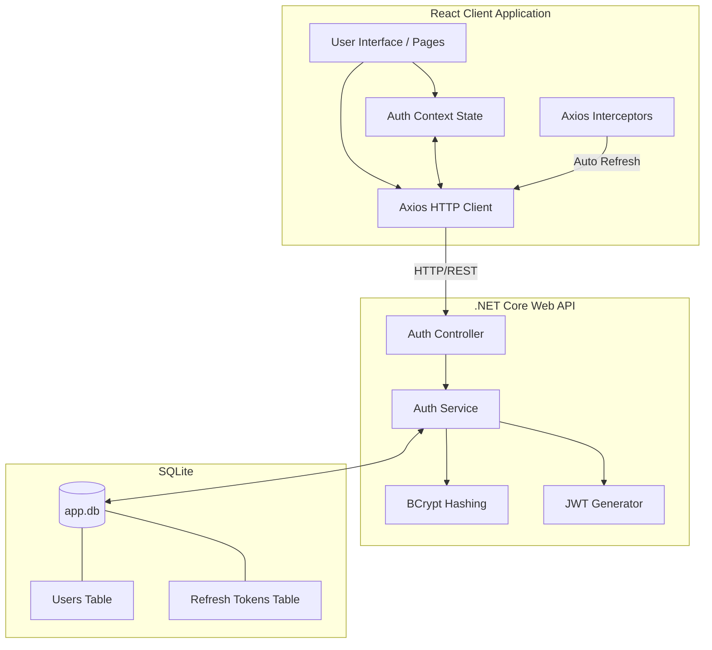

# 🛡️ Full-Stack Authentication System

This project is the website for a full-stack authentication system with Client-Server architecture. It is designed to provide secure user authentication and authorization for web applications.

## Features
- Highly secure authentication:
    - Login and registration with password hashing (BCrypt).
    - JWT (JSON Web Token) for session management.
    - Lockout mechanism after multiple failed login attempts: After 5 failed login attempts, the account will be locked for 15 minutes. Force a full device logout when the account is locked.
- User management:
    - User registration and login.
    - See the roles of the user in this website (e.g., admin, user).
- Data Management:
    - Store user data securely in a database (SQL).

## Tech Stack
- Frontend: ReactJS + Typescript
- Backend: .NET Core
- Database: SQL Lite.

## Installation
Before you begin, ensure you have the following installed on your machine:
- [Node.js](https://nodejs.org/)(version 18 or higher)
- [.NET Core SDK](https://dotnet.microsoft.com/download)(version 8.0 or higher)

### 1. Clone the repository:
```bash
git clone https://github.com/quanlinhson/test-company-ll.git
```

### 2. Navigate to the project directory:
```bash 
cd test-company-ll
```

### 3. Set up the backend:
- Navigate to the backend directory:
```bash
cd Backend
```
- Install dependencies:
```bash
dotnet restore
```
- Environmemt variable configuration:
Open the `appsettings.json` file and make sure you have a sufficiently strong Secret Key (at least 256-bit / 32 characters) for JWT token generation. You can generate a strong key using online tools or libraries.
```JSON
{
  "Jwt": {
    "Key": "your-strong-secret-key-here",
    "Issuer": "your-app-name",
    "Audience": "your-app-audience"
  }
}
```
- Run the backend server:
```bash
dotnet run
```

### 4. Set up the frontend:
- Navigate to the frontend directory:
```bash
cd frontend
```

- Install dependencies:
```bash
npm install
```

- Run the frontend development server:
```bash
npm run dev
```
## Architecture Diagram
The system follows a Client-Server architecture, where the frontend (ReactJS) communicates with the backend (.NET Core) via RESTful APIs. The backend handles authentication, authorization, and data management, while the frontend provides a user-friendly interface for users to interact with the system.



## Components
### Frontend Components (ReactJS + Typescript)
- **Pages** (Login, Register, Dashboard, etc.): Handle User Interface and user interactions. Built with reusable React components and styled with CSS.
- **Resumable Components**(FloatingInput, Navbar): Isolated UI elements that can be reused across different pages.
- **AuthContext** (AuthContext.tsx): Manages authentication state and provides context to the entire application.
- **Axios HTTP Client** (axiosClient.ts): Configured Axios instance for making HTTP requests to the backend.

### Backend Components (.NET Core Web API)
- **AuthController**: Handles incoming HTTP requests related to authentication (login, register, refresh token) and delegates the logic to the AuthService.
- **AuthService**: Contains the core business logic for authentication, including password hashing, JWT generation, and token management.
- **BCrypt**: Used for securely hashing and verifying user passwords.
- **Entity Framework Core (EF Core)**: Used for database interactions, including user and token management.

## Data Flow Explanation
### A. Standard Login Flow:
1. Client: The user submits login credentials (email and password) via the login form. 
2. API: Axios sends a POST request to the backend's `/api/auth/login` endpoint with the credentials.
3. Validation: The .Net Backend queries the Users table by email. If the user exists, it uses BCrypt.Verify to compare the provided password with the stored hashed password.
4. Token Generation: If the password is valid, the backend generates 2 tokens:
   - **Access Token**: A short-lived JWT (e.g., 15 minutes) that contains user information and roles.
   - **Refresh Token**: A long-lived token (e.g., 7 days) that can be used to obtain a new access token when the current one expires.
5. Client State: React receives the tokens and stores them in memory (or local storage) and updates the authentication state in AuthContext.

### B. Refresh Token Flow:
1. Trigger: The user's access token expires after 15 minutes.
2. Interceptor: When the frontend attempts to make an API call, the backend rejects it with a 401 Unauthorized response.
3. Silent Refresh: The Axios interceptor detects the 401 response and automatically sends a request to the `/api/auth/refresh` endpoint with the refresh token.
4. Backend Validation: The backend verifies the refresh token against the database. If valid, it generates a new access token and returns it to the frontend.
5. Rotation: The backend also generates a new refresh token, invalidates the old one, and updates the database. The frontend receives the new tokens and updates its state accordingly.
6. Resume: The user continues to use the application without needing to log in again, as long as the refresh token remains valid.

### C. Security & Lockout Flow:
1. Failed Login Attempts: The backend tracks the number of failed login attempts for each user.
2. Lockout Trigger: After 5 failed login attempts, the backend locks the user's account for 15 minutes.
3. Global Sign-out: The backend executes a query to find all active refresh tokens associated with the user and invalidates them, effectively logging the user out from all devices.
4. Client Notification: The frontend receives a response indicating that the account is locked and displays an appropriate message to the user.